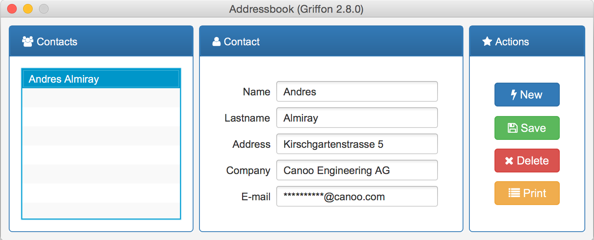

= Addressbook

Tiny addressbook application. Showcases the usage of `spring-guice` to integrate Spring based
beans into a Griffon application. Relies on `spring-data` for easy persistence setup.

Plugins used in this project:

 * link:http://griffon-plugins.github.io/griffon-miglayout-plugin/[griffon-miglayout-plugin]
 * link:http://griffon-plugins.github.io/griffon-glazedlists-plugin/[griffon-glazedlists-plugin]

Libraries used in this project:

 * link:https://projectlombok.org/features/index.html[Lombok]
 * link:http://projects.spring.io/spring-boot/[Spring Boot]
 * link:http://projects.spring.io/spring-data/[Spring Data]
 * link:https://github.com/spring-projects/spring-guice[spring-guice]
 * link:https://github.com/aalmiray/bootstrapfx[BootstrapFX]
 * link:http://aalmiray.github.io/ikonli/[Ikonli]
 * link:https://github.com/TomasMikula/EasyBind[Easybind]

== License

All code found in this repository is licensed under GPL v3

[source]
----
Copyright 2016-2018 Andres Almiray

This file is part of Griffon Examples

Griffon Examples is free software: you can redistribute it and/or modify
it under the terms of the GNU General Public License as published by
the Free Software Foundation, either version 3 of the License, or
(at your option) any later version.

Griffon Examples is distributed in the hope that it will be useful,
but WITHOUT ANY WARRANTY; without even the implied warranty of
MERCHANTABILITY or FITNESS FOR A PARTICULAR PURPOSE.  See the
GNU General Public License for more details.

You should have received a copy of the GNU General Public License
along with Griffon Examples. If not, see <http://www.gnu.org/licenses/>.
----
